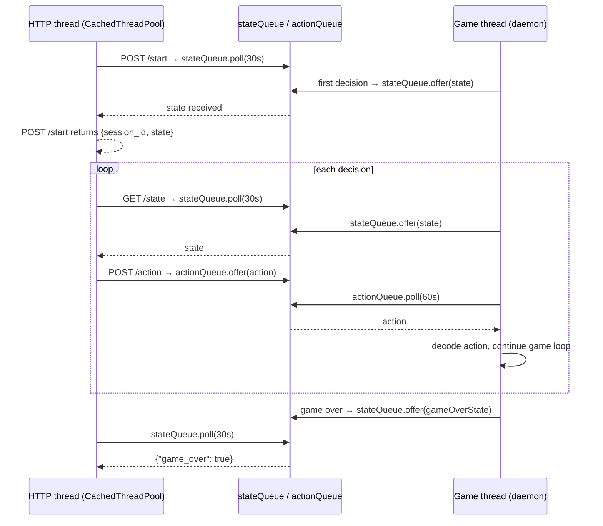

# Feature 1: Implementation Notes

## Status: Complete

## New Files

| File | Description |
|------|-------------|
| `forge-gui-desktop/src/main/java/forge/view/server/GameSession.java` | Holds per-game state: `Game` ref, `stateQueue` (game→HTTP), `actionQueue` (HTTP→game), `gameOver` flag |
| `forge-gui-desktop/src/main/java/forge/view/server/PlayerControllerHttp.java` | Extends `PlayerControllerAi`; surfaces `chooseSpellAbilityToPlay`, `declareAttackers`, `declareBlockers` to the HTTP client via blocking queues; AI fallback on 60 s timeout |
| `forge-gui-desktop/src/main/java/forge/view/server/HttpGameServer.java` | Embedded HTTP server (JDK `com.sun.net.httpserver`); manages a `ConcurrentHashMap` of sessions; routes four endpoints |

## Modified Files

| File | Change |
|------|--------|
| `forge-gui-desktop/src/main/java/forge/view/Main.java` | Replaced "Not implemented" stub with `HttpGameServer.start(args)` |
| `forge-ai/src/main/java/forge/ai/PlayerControllerAi.java` | Made `computeAvailableSpells()`, `computeEligibleAttackers()`, `computeEligibleBlockers()` `protected` for `PlayerControllerHttp` to reuse |

No new Maven dependencies — uses only the JDK's built-in `jdk.httpserver` module.

## CLI

```
java -jar forge.jar server --port 8080
```

## API Reference

### `POST /game/start`

Request:
```json
{
  "decks": ["RG Aggro", "UW Control"],
  "format": "Constructed",
  "ai_slots": [1]
}
```
- `ai_slots`: player indices driven by Forge's AI. Remaining indices are HTTP-controlled.
- `format`: any `GameType` name (case-insensitive). Defaults to `Constructed`.

Response `200`:
```json
{
  "session_id": "000001",
  "turn": 1,
  "phase": "UNTAP",
  "active_player": "Player1-RG Aggro",
  "players": [ ... ],
  "awaiting_action": {
    "player_index": 0,
    "decision_type": "cast_or_pass",
    "choices": [
      { "type": "PASS_PRIORITY" },
      { "type": "CAST_SPELL", "card_id": 42, "card_name": "Lightning Bolt", "api_type": "DealDamage", "description": "Lightning Bolt deals 3 damage to any target." }
    ]
  }
}
```

### `GET /game/{session_id}/state`

Long-poll. Blocks up to 30 s waiting for a decision point. Returns the same shape as the `/start` response (without `session_id`). Returns `408` on timeout, `{"game_over": true, "winner": "..."}` when the game ends.

### `POST /game/{session_id}/action`

Submit the client's choice and receive the next decision point.

Request shapes:

| Decision type | Body |
|---|---|
| Pass priority | `{"type": "PASS_PRIORITY"}` |
| Cast a spell | `{"type": "CAST_SPELL", "card_id": 42}` |
| Activate ability | `{"type": "ACTIVATE_ABILITY", "card_id": 42, "ability_index": 0}` |
| Declare attackers | `{"type": "DECLARE_ATTACKERS", "attackers": [42, 51]}` |
| Declare blockers | `{"type": "DECLARE_BLOCKERS", "assignments": [{"blocker_id": 5, "attacker_id": 12}]}` |

Returns the next state (same shape as `/state`), or `{"game_over": true, "winner": "..."}`.

### `POST /game/{session_id}/stop`

Terminates the game thread and removes the session. Returns `{}`.

## Key Design Decisions

- **`PlayerControllerHttp extends PlayerControllerAi`**: all 60+ abstract `PlayerController` methods are implemented for free; only the three strategic decisions are surfaced over HTTP. All other decisions (targeting, modal choices, mulligan, mana payment) are handled by the AI heuristics.
- **`player.dangerouslySetController()`**: injected after `mc.createGame()`, before `mc.startGame()`. This is the documented pattern used by Forge's own multiplayer server (`FServerManager`).
- **`LinkedBlockingQueue<>(1)` for both directions**: game thread puts one state, blocks on action; HTTP thread takes state, puts action, takes next state. Capacity-1 prevents stale states accumulating.
- **Game-over sentinel in `finally`**: `session.gameOver.set(true)` and `session.stateQueue.offer(gameOverState)` are inside the `finally` block in `runGame()`, guaranteeing delivery even if `mc.startGame()` throws.
- **No Javalin / no Jetty conflict**: the existing codebase uses Jetty 9.4 via `forge-gui`. Adding Javalin 6 would import Jetty 11+, causing version conflicts. The JDK's `HttpServer` avoids this entirely.

## Threading Model


