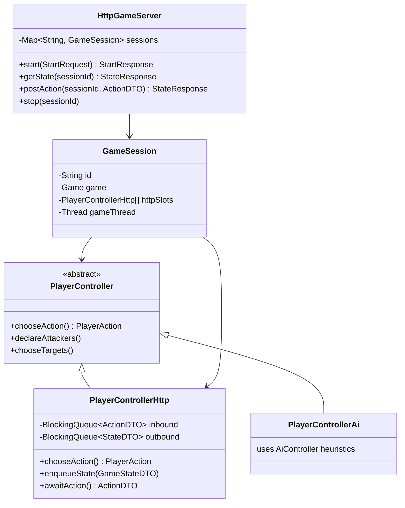

# Feature 1: HTTP Simulation Endpoint

## Goal

Expose an HTTP server so an external process — an LLM, a script, or a human client — can play as one or both players in a Forge game. Forge enforces the rules and presents legal actions; the client picks from them.

## Motivation

The existing `SimulateMatch` CLI only supports Forge's own heuristic AI. `Main.java` already has a `case "server"` stub that prints "Not implemented." This feature completes it.

## Architecture

```mermaid
sequenceDiagram
    participant Client as LLM Agent / Client
    participant Server as forge-server (HTTP)
    participant Loop as Game Loop Thread
    participant Engine as Rules Engine (forge-game)

    Client->>Server: POST /game/start
    Server->>Loop: Start headless game, inject PlayerControllerHttp
    Loop->>Engine: Initialize match
    Engine-->>Loop: Decision point reached
    Loop-->>Server: Enqueue state + legal actions
    Server-->>Client: 200 { state, awaiting_action }

    loop Each decision
        Client->>Server: GET /game/{id}/state
        Server-->>Client: { state, awaiting_action: { choices: [...] } }
        Client->>Server: POST /game/{id}/action { type, card_id, ... }
        Server->>Loop: Dequeue chosen action
        Loop->>Engine: Apply action
        Engine-->>Loop: Next decision point
        Loop-->>Server: Enqueue new state
        Server-->>Client: { state, awaiting_action, game_over }
    end

    Client->>Server: POST /game/{id}/stop
```

## Component Design



## API Reference

### POST `/game/start`

```json
// Request
{
  "decks": ["UW Control", "RG Aggro"],
  "format": "standard",
  "ai_slots": [1]
}
```

`ai_slots` lists which player indices are driven by Forge's AI. Omitted indices are driven by the HTTP client.

```json
// Response 200
{
  "session_id": "a3f9c1",
  "state": { ... },
  "awaiting_action": {
    "player": 0,
    "choices": [ { "type": "PASS_PRIORITY" }, { "type": "CAST_SPELL", "card_id": "42", "targets": [] } ]
  }
}
```

### GET `/game/{session_id}/state`

Returns the current state and the next pending decision. Blocks until a decision point is ready (long-poll, max 30 s).

### POST `/game/{session_id}/action`

```json
// Request — must be one of the choices listed in awaiting_action
{ "type": "CAST_SPELL", "card_id": "42", "targets": ["57"] }
```

Returns the state after the action and the next decision point, or `"game_over": true` with a result.

### POST `/game/{session_id}/stop`

Terminates the game thread and cleans up the session.

## State and Action DTOs

### GameStateDTO

```json
{
  "turn": 5,
  "phase": "MAIN1",
  "active_player": 0,
  "players": [
    {
      "index": 0,
      "life": 20,
      "hand": [ { "id": "42", "name": "Counterspell", "mana_cost": "UU", "types": ["Instant"] } ],
      "battlefield": [ ... ],
      "graveyard": [ ... ],
      "mana_pool": { "W": 0, "U": 2, "B": 0, "R": 0, "G": 0, "C": 0 },
      "lands_played_this_turn": 1
    },
    {
      "index": 1,
      "life": 17,
      "hand": [ { "hidden": true }, { "hidden": true } ],
      "battlefield": [ ... ],
      "graveyard": [ ... ],
      "mana_pool": { "W": 0, "U": 0, "B": 0, "R": 2, "G": 1, "C": 0 },
      "lands_played_this_turn": 1
    }
  ],
  "stack": [],
  "library_sizes": [32, 35]
}
```

The opponent's hand cards are returned as `{ "hidden": true }` — the client only sees what the active player can see.

### ActionDTO types

| type | extra fields | description |
|------|-------------|-------------|
| `CAST_SPELL` | `card_id`, `targets[]` | Cast a spell from hand |
| `ACTIVATE_ABILITY` | `card_id`, `ability_index`, `targets[]` | Activate a card's ability |
| `PASS_PRIORITY` | — | Pass priority to opponent |
| `DECLARE_ATTACKER` | `card_id` | Declare a creature as attacker |
| `DECLARE_BLOCKER` | `card_id`, `blocks` | Assign a blocker to an attacker |
| `SELECT_CARD` | `card_id` | Select a card (modal choices, etc.) |
| `CONFIRM` | `value` (bool) | Yes/no confirmation prompt |
| `PLAY_LAND` | `card_id` | Play a land from hand |

## Implementation Notes

- Embedded HTTP server: **Javalin** (minimal footprint, no Spring, runs on Jetty under the hood). Add `io.javalin:javalin` to `forge-gui-desktop/pom.xml`.
- Entry point in `Main.java` `case "server"`:
  ```
  java -jar forge.jar server --port 8080 --deck0 "UW Control" --deck1 "RG Aggro" --ai-slot 1
  ```
- Game loop runs on a background thread. `PlayerControllerHttp.chooseAction()` blocks on `inbound.take()` until the client posts an action.
- Timeout: if no action arrives within 60 s, default to `PASS_PRIORITY` and log a warning.
- One session per server instance for now; extend to multi-session via `session_id` map later.
