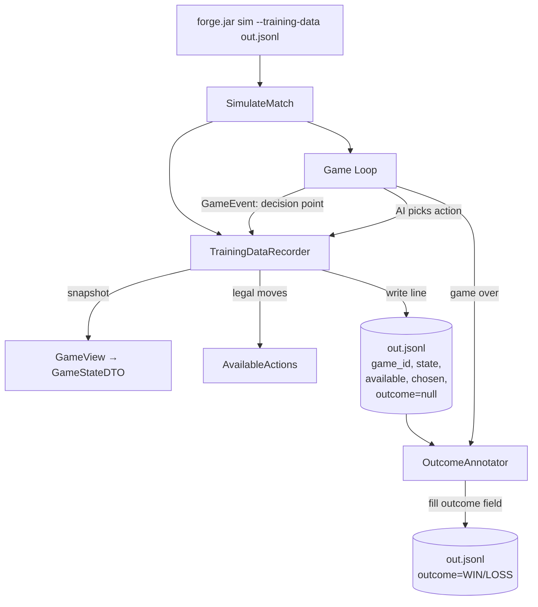
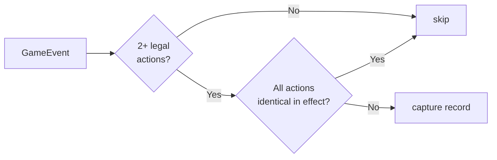
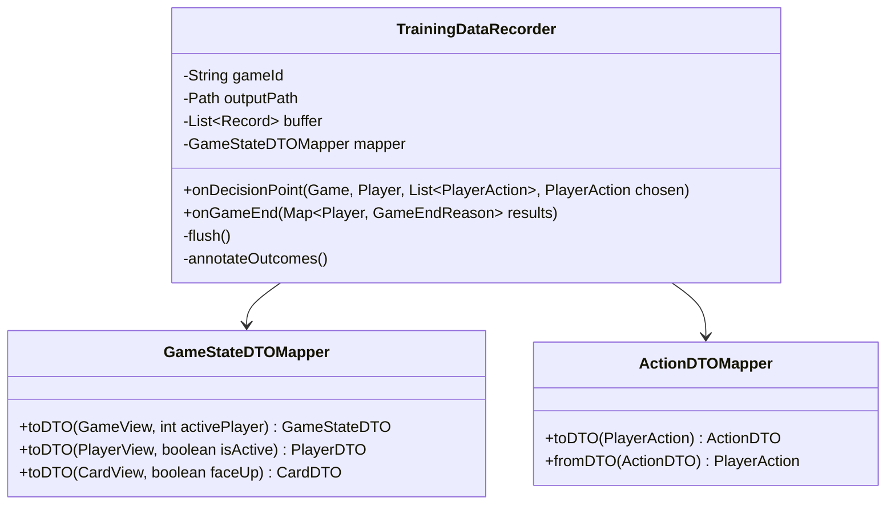

# Feature 2: Game Training Data

## Goal

When running headless simulations, capture every meaningful decision point as a labelled training example: what the player could observe, what actions were legal, which action was taken, and — once the game ends — whether that player won or lost.

## Motivation

The heuristic AI in `forge-ai` makes millions of decisions, but none of them are recorded. This feature turns every simulation run into a labelled dataset usable for supervised fine-tuning or behavioural cloning of an LLM agent.

## Data Flow



## Record Schema

One JSON object per line. Each record is one decision point.

```json
{
  "game_id": "3f8a1c",
  "record_index": 14,
  "turn": 5,
  "phase": "COMBAT_DECLARE_ATTACKERS",
  "state": {
    "turn": 5,
    "phase": "COMBAT_DECLARE_ATTACKERS",
    "active_player": 0,
    "players": [ { ... } ],
    "stack": [],
    "library_sizes": [30, 33]
  },
  "available_actions": [
    { "type": "DECLARE_ATTACKER", "card_id": "12" },
    { "type": "DECLARE_ATTACKER", "card_id": "15" },
    { "type": "PASS_PRIORITY" }
  ],
  "chosen_action": { "type": "DECLARE_ATTACKER", "card_id": "12" },
  "metadata": {
    "player": 0,
    "deck": "RG Aggro",
    "format": "standard",
    "outcome": "WIN"
  }
}
```

`outcome` is written as `null` during the game and back-filled after the match ends.

## What Counts as a Decision Point

Not every game event is worth recording — only points where a meaningful choice exists:



**Captured:**
- Casting a spell (hand has 2+ castable options, or cast vs. pass)
- Activating an ability
- Declaring attackers (any subset of attackers)
- Declaring blockers
- Choosing targets (multiple valid targets exist)
- Passing priority when spells/abilities are castable

**Skipped:**
- Mana payment (mechanical, no strategic choice)
- Ordering simultaneous triggers (high noise, low signal)
- Decisions where only one legal action exists

## Implementation

### TrainingDataRecorder

New class in `forge-ai/src/main/java/forge/ai/training/TrainingDataRecorder.java`.



### Hook Points in the Game Loop

`PlayerControllerAi` (and `PlayerControllerHttp` for Feature 1) already intercept every decision via `choose*` methods. Add recorder calls there:

```
// In PlayerControllerAi.chooseAction() (pseudocode):
List<PlayerAction> legal = AvailableActions.compute(player);
PlayerAction chosen = aiController.pickAction(legal);
if (recorder != null) {
    recorder.onDecisionPoint(game, player, legal, chosen);
}
return chosen;
```

### CLI Activation

```
java -jar forge.jar sim -d "RG Aggro" "UW Control" -n 1000 --training-data games.jsonl
```

Without `--training-data`, the recorder is not instantiated and there is no overhead.

### Output Size Estimate

~50 decisions per game × 1 000 games = ~50 000 records. A typical record (compressed state) is ~2–4 KB. Expect ~100–200 MB per 1 000 games uncompressed; add `--training-data-gz` flag to write gzip-compressed JSONL.

## Post-Processing

A small standalone tool or a second pass of the same CLI annotates outcomes:

```
java -jar forge.jar annotate-outcomes --input games.jsonl --output games_labelled.jsonl
```

Reads all records for each `game_id`, finds the `onGameEnd` terminal record, and back-fills `metadata.outcome` for every record with that `game_id`.
