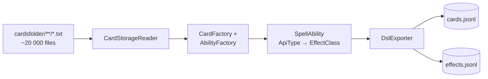
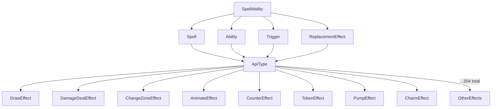
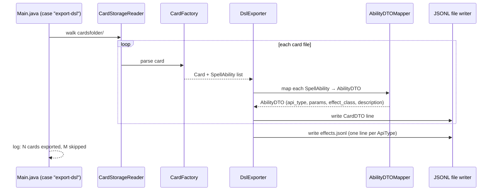

# Feature 3: Card DSL Serialization

## Goal

Export every card's implementation as structured JSON — pairing the raw Forge DSL with the card's Oracle text and the concrete Java effect class that executes it. The output is a corpus an LLM can be trained or prompted with to understand what cards do and how they are expressed.

## Motivation

Forge's card DSL is a bespoke language. An LLM that needs to reason about cards — or generate new ones — must learn the mapping between:
- Human-readable rules text (`Oracle:`)
- The DSL notation (`T:Mode$ ChangesZone | ...`)
- The Java effect that runs when the ability resolves (`DrawEffect`, `DamageDealEffect`, etc.)

~20 000 cards already have this mapping implicitly. This feature makes it explicit and machine-readable.

## Source Material



## Card Record Schema

```json
{
  "name": "Roving Harper",
  "mana_cost": "2W",
  "cmc": 3,
  "types": ["Creature"],
  "subtypes": ["Elf", "Scout"],
  "supertypes": [],
  "pt": "2/2",
  "oracle": "When Roving Harper enters, draw a card.",
  "abilities": [
    {
      "raw_dsl": "T:Mode$ ChangesZone | Origin$ Any | Destination$ Battlefield | ValidCard$ Card.Self | Execute$ TrigDraw\nSVar:TrigDraw:DB$ Draw | Defined$ You | NumCards$ 1",
      "api_type": "Draw",
      "parameters": {
        "Mode": "ChangesZone",
        "Origin": "Any",
        "Destination": "Battlefield",
        "Defined": "You",
        "NumCards": "1"
      },
      "effect_class": "forge.game.ability.effects.DrawEffect",
      "trigger_type": "ChangesZone",
      "description": "When this permanent enters the battlefield, its controller draws 1 card."
    }
  ]
}
```

`description` is derived from `SpellAbility.getStackDescription()` — already computed by the engine, no LLM needed.

## Effect Vocabulary Schema

A companion file covering all 204 `SpellAbilityEffect` subclasses, giving an LLM a DSL reference:

```json
{
  "api_type": "Draw",
  "effect_class": "forge.game.ability.effects.DrawEffect",
  "description": "Makes one or more players draw cards.",
  "key_parameters": [
    { "name": "Defined",   "description": "Who draws (You, Opponent, Each Player, ...)" },
    { "name": "NumCards",  "description": "How many cards to draw" },
    { "name": "Optional",  "description": "Whether the draw is optional (true/false)" }
  ],
  "example_cards": ["Roving Harper", "Divination", "Brainstorm"]
}
```

## Ability Taxonomy



## DSL Notation Primer (included in export)

Each card's abilities use pipe-delimited key-value pairs. Key abbreviations:

| Abbreviation | Meaning |
|---|---|
| `T:` | Trigger definition |
| `AB$` | Ability type (ApiType enum name) |
| `DB$` | Delayed ability / sub-ability type |
| `SVar:` | Script variable (named sub-ability or value) |
| `Defined$` | Who is targeted (You, Opponent, Card.Self, ...) |
| `ValidTgts$` | Target validation predicate |
| `Cost$` | Mana or other cost to activate |
| `Condition$` | Condition that must be true to resolve |
| `Duration$` | How long the effect lasts (Permanent, UntilEOT, ...) |
| `NumCards$` | Integer count (often an SVar referencing X) |
| `Mode$` | Sub-mode for triggers (ChangesZone, Attacks, Becomes, ...) |

## Implementation

### DslExporter Class

New class: `forge-game/src/main/java/forge/game/ability/export/DslExporter.java`



### CLI Activation

```
java -jar forge.jar export-dsl --output cards.jsonl --effects effects.jsonl
```

Optional flags:
- `--skip-errors` — skip cards that fail to parse (default: skip and log)
- `--format standard` — filter to cards legal in a specific format

### Error Handling

Cards that fail `AbilityFactory` parsing are skipped and counted. A summary line is printed at the end:

```
Exported 19 847 cards, skipped 153 (parse errors logged to export-errors.log)
```

## Output Size Estimate

~20 000 cards × ~1 KB per record ≈ ~20 MB uncompressed JSONL. Trivially fits in LLM context windows for batch processing.
