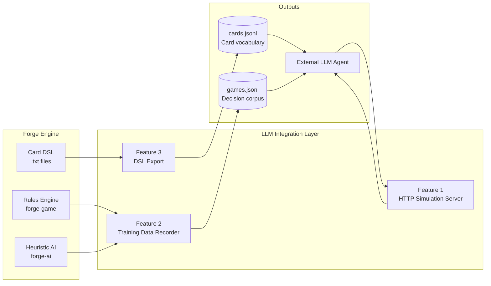

# LLM Integration — Overview

Forge is a complete Magic: The Gathering rules engine. It enforces all game rules, hosts a heuristic AI, and runs headless simulations. This initiative adds three capabilities that together make Forge a foundation for LLM-based game agents and card-logic training.

## The Big Picture

The long-term goal is a feedback loop:

1. **Teach an LLM the card language** — serialize the card DSL so a model can learn what every card does and how it is described.
2. **Generate labelled play data** — run thousands of simulated games and record every decision point (state, legal actions, chosen action, outcome) as training examples.
3. **Replace the heuristic AI with an LLM agent** — expose an HTTP interface so an external model can play as a player in real time, using the training data to make informed decisions.

## Features

| # | Spec | Implementation | What it produces | Status |
|---|------|----------------|-----------------|--------|
| [1](feature1/spec.md) | [HTTP Simulation Endpoint](feature1/spec.md) | [implementation](feature1/implementation.md) | Live game interface for an LLM agent | ✅ Complete |
| [2](feature2/spec.md) | [Game Training Data](feature2/spec.md) | [implementation](feature2/implementation.md) | JSONL decision corpus from simulated games | ✅ Complete |
| [3](feature3/spec.md) | [Card DSL Serialization](feature3/spec.md) | [implementation](feature3/implementation.md) | JSONL card vocabulary for LLM training | ✅ Complete |
| [4](feature4/spec.md) | [DSL Byte Protocol](feature4/spec.md) | [implementation](feature4/implementation.md) | Vocabulary survey → byte token assignments for LLM training | ✅ Phase 1 Complete |

## Recommended Delivery Order

```mermaid
gantt
    title Delivery Sequence
    dateFormat  X
    axisFormat  %s

    section Phase 1
    Feature 3 — DSL Export       :f3, 0, 2
    section Phase 2
    Feature 2 — Training Data    :f2, after f3, 2
    section Phase 3
    Feature 1 — HTTP Server      :f1, after f2, 3
```

**Feature 3 first** — purely additive, no game-loop changes. Validates the JSON serialization setup and produces the card vocabulary. ✅

**Feature 2 second** — passive recorder hooked into the existing simulation CLI. Uses the same JSON infrastructure as Feature 3. ✅

**Feature 1 last** — requires a new `PlayerController` implementation and an embedded HTTP server. Depends on the DTO layer established by Features 2 and 3. ✅

## Shared Infrastructure

All three features share:

- **Jackson** (`jackson-databind`) — added to root `pom.xml`; currently the codebase has no JSON library.
- **DTO package** `forge.llm.dto` — `GameStateDTO`, `CardDTO`, `ActionDTO`, `PlayerDTO` shared across features 1 and 2.
- **CLI flags** — each feature is activated via a flag on the existing `java -jar forge.jar` entry point in `Main.java`.
